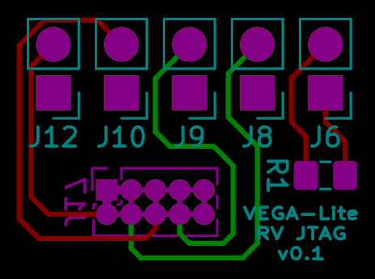

# VEGA-Lite RISC-V JTAG Connection Board

> A board for connecting FreeLink headers to RISC-V JTAG port on VEGA-Lite development board.

## Notice

Work for VEGA-Lite only, doesn't work with VEGAboard. 

Designed with KiCad 5.1.4. 

## Contributing

Issues and pull requests are welcome, always. 

## License

Copyright (c) 2019 SHA Miao `<sha@miao.im>`

This project is licensed under [Solderpad Hardware License v. 0.51](http://www.apache.org/licenses/LICENSE-2.0) ([LICENSE](LICENSE)).
